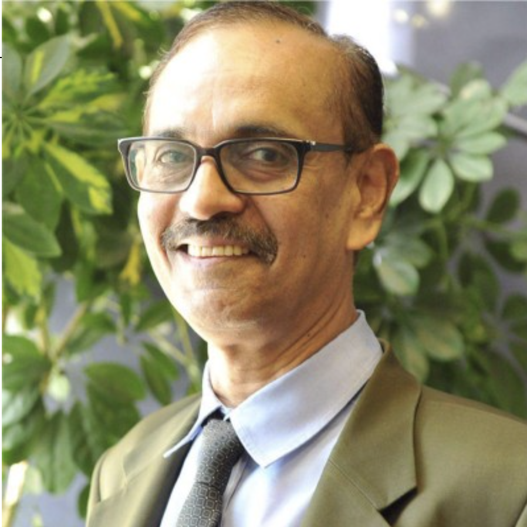
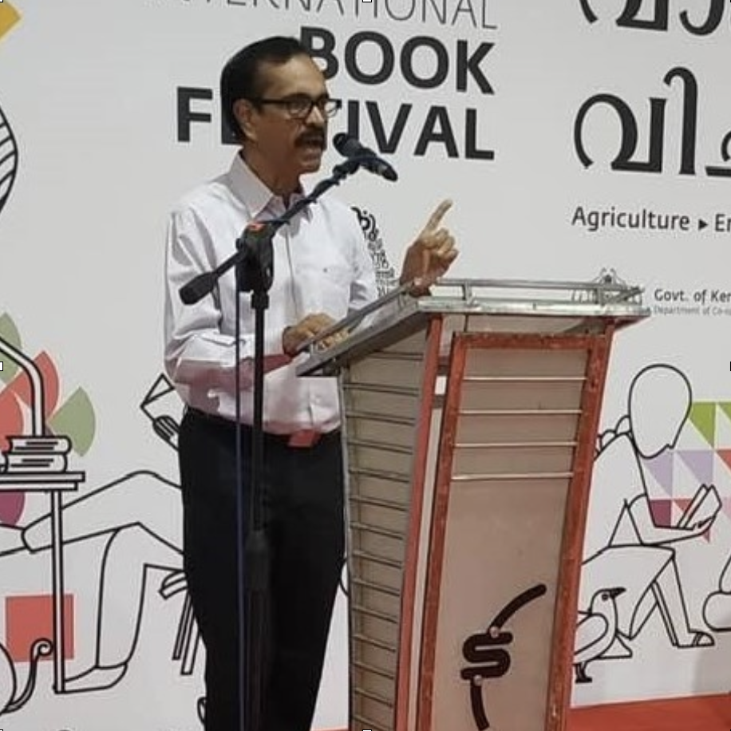
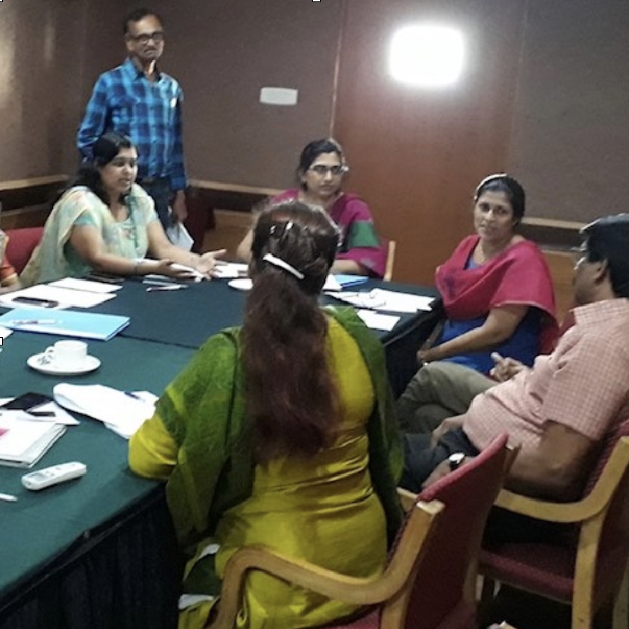
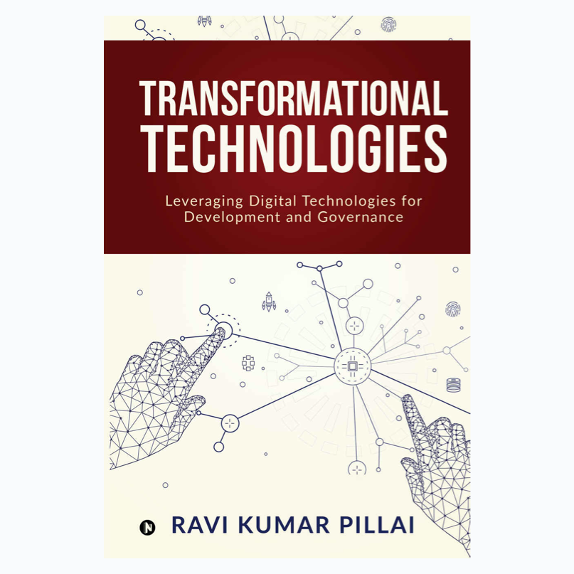

<section class="demo">
  

    

      
    

    

      
    

  

</section>

Ravi Kumar Pillai has over three decades of corporate and consulting experience with multinationals and Indian companies. He has wide ranging experience in Oil & Gas, Telecom, Iron & Steel and FMCG sectors. 

**A prolific writer**, he has a book recently and is a regular blogger. His articles have appeared in Times of India, Economic Times, Financial Express.  An alumni of **Jamnalal Bajaj institute of Management Studies**, Mumbai. He worked for **SAIL, RPG Group, Aditya Birla Group, Exxon Mobil and Etisalat Group (UAE)**

<section class="demo">
  

    

      
    

    

      
    

    

      
    

    

      <h4 id="contactme" style="line-height: 42px;"><a href="https://www.amazon.in/Transformational-Technologies-Leveraging-Development-Governance-ebook/dp/B084WR9MGB">Buy Transformational Technologies on Amazon</a></h4>
    

  

</section>

He was **Lead Internal Consultant** for strategic transformation aand turnaround projects. He has consulted in **Organization Design, Total Rewards Management and Executive Compensation, Leadership Coaching and Mentoring.**

Reach out to me at [hello@ravikumarpillai.com](mailto:hello@ravikumarpillai.com) or [chat on WhatsApp](https://wa.me/919995805987)
